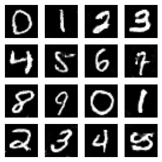

# Tensorflow MNIST cGAN

This repository contains an implementation of a conditional generative adversarial network (cGAN) in TensorFlow.

## Getting started

Install the dependencies

```
tensorflow
matlplotlib
numpy
```

## Results

```
noise = tf.random.normal([16, LATENT_DIM])
label = np.array([0, 1, 2, 3, 4, 5, 6, 7, 8, 9, 0, 1, 2, 3, 4, 5])
generate_images(generator, 0, noise, label)
```

